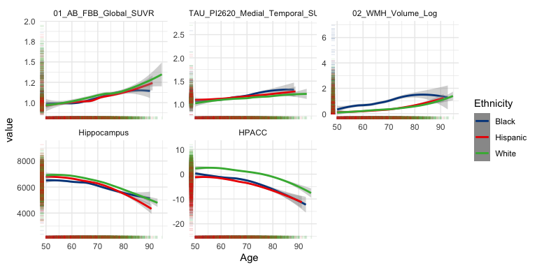

<!-- README.md is generated from README.Rmd. Please edit that file -->
<!-- R package versioning: first two digits are for code; last digit is data release number  -->

# HABS-HD <a href="https://apps.unthsc.edu/itr/research/"></a>

## Overview

`HABSHD` is an R package containing data and code to reproduce results
from the **The Health & Aging Brain Study: Health Disparities
(HABS-HD)** study (O’Bryant et al. 2021). `HABSHD` is a bundle of data,
analysis code examples, and html and pdf documentation. The html
documentation is viewable at <https://github.com/mcdonohue/HABSHD>.

All data, including the `HABSHD` R package, is avalialable from
<https://apps.unthsc.edu/itr/research/> after registering and agreeing
to the [data use
agreement](https://apps.unthsc.edu/itr/assets/documents/HABS_HD%20DUA.final.pdf).

## Installation

To install `HABSHD`:

- Register at <https://apps.unthsc.edu/itr/research>
- Download `HABSHD_0.1.5.tar.gz` from
  <https://apps.unthsc.edu/itr/research/>
- In R, run
  `install.packages("path/to/HABSHD_0.1.5.tar.gz", repos = NULL, type = "source")`

The script to build this R package can be found in
[tools](https://github.com/mcdonohue/HABSHD/tree/main/tools).

The code below demonstrates how to use data in the `HABSHD` package and
R Core Team (2024) to derive some basic summaries.

# Baseline characteristics tables

``` r
tableby(CDX_Cog ~ . , data = HD_subjinfo %>% 
    select(-Med_ID, -Visit_ID, -APOE4_rs429358, -APOE4_rs7412)) %>%
  summary(labelTranslations = HD_labels, digits = 1)
```

|  | Cognitively Unimpaired (N=2359) | Mild cognitive impairment (N=651) | Dementia (N=219) | Total (N=3229) | p value |
|:---|:--:|:--:|:--:|:--:|---:|
| **Age** |  |  |  |  | \< 0.001 |
|    Mean (SD) | 64.7 (8.4) | 65.5 (8.9) | 68.9 (10.0) | 65.2 (8.7) |  |
|    Range | 50.0 - 90.0 | 50.0 - 92.0 | 50.0 - 91.0 | 50.0 - 92.0 |  |
| **Ethnicity** |  |  |  |  | \< 0.001 |
|    Black | 472 (20.0%) | 236 (36.3%) | 63 (28.8%) | 771 (23.9%) |  |
|    Hispanic | 898 (38.1%) | 250 (38.4%) | 83 (37.9%) | 1231 (38.1%) |  |
|    White | 989 (41.9%) | 165 (25.3%) | 73 (33.3%) | 1227 (38.0%) |  |
| **APOE4 SNP** |  |  |  |  | \< 0.001 |
|    N-Miss | 297 | 77 | 39 | 413 |  |
|    E2E2 | 6 (0.3%) | 5 (0.9%) | 0 (0.0%) | 11 (0.4%) |  |
|    E2E3 | 205 (9.9%) | 59 (10.3%) | 17 (9.4%) | 281 (10.0%) |  |
|    E2E4 | 46 (2.2%) | 11 (1.9%) | 4 (2.2%) | 61 (2.2%) |  |
|    E3E3 | 1312 (63.6%) | 341 (59.4%) | 83 (46.1%) | 1736 (61.6%) |  |
|    E3E4 | 450 (21.8%) | 141 (24.6%) | 59 (32.8%) | 650 (23.1%) |  |
|    E4E4 | 43 (2.1%) | 17 (3.0%) | 17 (9.4%) | 77 (2.7%) |  |
| **APOE4 Positivity** |  |  |  |  | \< 0.001 |
|    N-Miss | 297 | 77 | 39 | 413 |  |
|    Mean (SD) | 0.3 (0.4) | 0.3 (0.5) | 0.4 (0.5) | 0.3 (0.4) |  |
|    Range | 0.0 - 1.0 | 0.0 - 1.0 | 0.0 - 1.0 | 0.0 - 1.0 |  |
| **Hispanic** |  |  |  |  | 0.985 |
|    No | 1461 (61.9%) | 401 (61.6%) | 136 (62.1%) | 1998 (61.9%) |  |
|    Yes | 898 (38.1%) | 250 (38.4%) | 83 (37.9%) | 1231 (38.1%) |  |
| **Race White** |  |  |  |  | \< 0.001 |
|    No | 478 (20.3%) | 242 (37.2%) | 65 (29.7%) | 785 (24.3%) |  |
|    yes | 1881 (79.7%) | 409 (62.8%) | 154 (70.3%) | 2444 (75.7%) |  |
| **Race Black** |  |  |  |  | \< 0.001 |
|    No | 1882 (79.8%) | 412 (63.3%) | 154 (70.3%) | 2448 (75.8%) |  |
|    yes | 477 (20.2%) | 239 (36.7%) | 65 (29.7%) | 781 (24.2%) |  |
| **Race IndianAlaska** |  |  |  |  | 0.162 |
|    No | 2346 (99.4%) | 643 (98.8%) | 218 (99.5%) | 3207 (99.3%) |  |
|    yes | 13 (0.6%) | 8 (1.2%) | 1 (0.5%) | 22 (0.7%) |  |
| **Race Specify AmerInd Tribe** |  |  |  |  |  |
|    N-Miss | 2359 | 651 | 219 | 3229 |  |
|    No | 0 | 0 | 0 | 0 |  |
|    yes | 0 | 0 | 0 | 0 |  |
| **Race Asian** |  |  |  |  | 0.852 |
|    No | 2356 (99.9%) | 650 (99.8%) | 219 (100.0%) | 3225 (99.9%) |  |
|    yes | 3 (0.1%) | 1 (0.2%) | 0 (0.0%) | 4 (0.1%) |  |
| **Race Specify Asian Race** |  |  |  |  |  |
|    N-Miss | 2359 | 651 | 219 | 3229 |  |
|    No | 0 | 0 | 0 | 0 |  |
|    yes | 0 | 0 | 0 | 0 |  |
| **Race Japanese** |  |  |  |  | 0.832 |
|    No | 2358 (100.0%) | 651 (100.0%) | 219 (100.0%) | 3228 (100.0%) |  |
|    yes | 1 (0.0%) | 0 (0.0%) | 0 (0.0%) | 1 (0.0%) |  |
| **Race Korean** |  |  |  |  | 0.832 |
|    No | 2358 (100.0%) | 651 (100.0%) | 219 (100.0%) | 3228 (100.0%) |  |
|    yes | 1 (0.0%) | 0 (0.0%) | 0 (0.0%) | 1 (0.0%) |  |
| **Race Vietnamese** |  |  |  |  |  |
|    No | 2359 (100.0%) | 651 (100.0%) | 219 (100.0%) | 3229 (100.0%) |  |
|    yes | 0 (0.0%) | 0 (0.0%) | 0 (0.0%) | 0 (0.0%) |  |
| **Race NativeHawaiian** |  |  |  |  |  |
|    No | 2359 (100.0%) | 651 (100.0%) | 219 (100.0%) | 3229 (100.0%) |  |
|    yes | 0 (0.0%) | 0 (0.0%) | 0 (0.0%) | 0 (0.0%) |  |
| **Race GuamChamorro** |  |  |  |  |  |
|    No | 2359 (100.0%) | 651 (100.0%) | 219 (100.0%) | 3229 (100.0%) |  |
|    yes | 0 (0.0%) | 0 (0.0%) | 0 (0.0%) | 0 (0.0%) |  |
| **Race Samoan** |  |  |  |  |  |
|    No | 2359 (100.0%) | 651 (100.0%) | 219 (100.0%) | 3229 (100.0%) |  |
|    yes | 0 (0.0%) | 0 (0.0%) | 0 (0.0%) | 0 (0.0%) |  |
| **Race OtherPacific** |  |  |  |  | 0.691 |
|    N-Miss | 9 | 0 | 2 | 11 |  |
|    Mean (SD) | 0.0 (0.0) | 0.0 (0.0) | 0.0 (0.0) | 0.0 (0.0) |  |
|    Range | 0.0 - 1.0 | 0.0 - 0.0 | 0.0 - 0.0 | 0.0 - 1.0 |  |
| **Race Specify OtherPacific Race** |  |  |  |  | 0.368 |
|    N-Miss | 2358 | 651 | 219 | 3228 |  |
|    Pacific | 1 (100.0%) | 0 | 0 | 1 (100.0%) |  |
| **Race Other** |  |  |  |  | 0.152 |
|    N-Miss | 0 | 0 | 1 | 1 |  |
|    Mean (SD) | 0.0 (0.0) | 0.0 (0.0) | 0.0 (0.1) | 0.0 (0.0) |  |
|    Range | 0.0 - 1.0 | 0.0 - 0.0 | 0.0 - 1.0 | 0.0 - 1.0 |  |
| **Race Specify** |  |  |  |  | 0.368 |
|    N-Miss | 2358 | 651 | 219 | 3228 |  |
|    Native American | 1 (100.0%) | 0 | 0 | 1 (100.0%) |  |
| **Gender** |  |  |  |  | \< 0.001 |
|    male | 806 (34.2%) | 301 (46.2%) | 107 (48.9%) | 1214 (37.6%) |  |
|    female | 1553 (65.8%) | 350 (53.8%) | 112 (51.1%) | 2015 (62.4%) |  |
| **Interview Language** |  |  |  |  | 0.556 |
|    English | 1800 (76.3%) | 502 (77.1%) | 161 (73.5%) | 2463 (76.3%) |  |
|    Spanish | 559 (23.7%) | 149 (22.9%) | 58 (26.5%) | 766 (23.7%) |  |
| **Language Primary** |  |  |  |  | 0.884 |
|    N-Miss | 7 | 2 | 2 | 11 |  |
|    English | 1753 (74.5%) | 487 (75.0%) | 158 (72.8%) | 2398 (74.5%) |  |
|    Spanish | 597 (25.4%) | 162 (25.0%) | 59 (27.2%) | 818 (25.4%) |  |
|    Other | 2 (0.1%) | 0 (0.0%) | 0 (0.0%) | 2 (0.1%) |  |
| **ADI StateRank** |  |  |  |  | \< 0.001 |
|    N-Miss | 178 | 51 | 32 | 261 |  |
|    Mean (SD) | 4.8 (2.9) | 5.8 (2.9) | 5.8 (2.9) | 5.1 (2.9) |  |
|    Range | 1.0 - 10.0 | 1.0 - 10.0 | 1.0 - 10.0 | 1.0 - 10.0 |  |
| **AB FBB AB pos** |  |  |  |  | \< 0.001 |
|    N-Miss | 806 | 200 | 86 | 1092 |  |
|    Mean (SD) | 0.2 (0.4) | 0.2 (0.4) | 0.5 (0.5) | 0.2 (0.4) |  |
|    Range | 0.0 - 1.0 | 0.0 - 1.0 | 0.0 - 1.0 | 0.0 - 1.0 |  |
| **TAU PI2620 Medial Temporal SUVR** |  |  |  |  | \< 0.001 |
|    N-Miss | 1435 | 375 | 150 | 1960 |  |
|    Mean (SD) | 1.1 (0.1) | 1.2 (0.2) | 1.3 (0.3) | 1.1 (0.2) |  |
|    Range | 0.8 - 1.8 | 0.9 - 2.0 | 0.9 - 2.6 | 0.8 - 2.6 |  |
| **L hippocampus** |  |  |  |  | \< 0.001 |
|    N-Miss | 112 | 43 | 24 | 179 |  |
|    Mean (SD) | 3167.1 (378.0) | 3062.6 (430.5) | 2729.1 (548.9) | 3118.2 (416.4) |  |
|    Range | 1545.0 - 4555.0 | 1555.1 - 4338.2 | 1135.0 - 4132.7 | 1135.0 - 4555.0 |  |
| **R hippocampus** |  |  |  |  | \< 0.001 |
|    N-Miss | 106 | 42 | 21 | 169 |  |
|    Mean (SD) | 3305.0 (391.0) | 3207.2 (420.0) | 2815.7 (603.0) | 3253.9 (431.1) |  |
|    Range | 1800.7 - 4701.0 | 1910.0 - 4425.0 | 1237.0 - 4164.7 | 1237.0 - 4701.0 |  |
| **ICV HD** |  |  |  |  | 0.514 |
|    N-Miss | 55 | 22 | 6 | 83 |  |
|    Mean (SD) | 1415993.2 (138521.5) | 1421683.2 (150085.9) | 1424525.3 (146413.1) | 1417708.5 (141430.2) |  |
|    Range | 1029783.2 - 1979485.0 | 1082025.6 - 1885733.6 | 1042479.9 - 1761099.9 | 1029783.2 - 1979485.0 |  |
| **Mean ICV HD** |  |  |  |  | 0.543 |
|    N-Miss | 55 | 22 | 6 | 83 |  |
|    Mean (SD) | 1416918.4 (137761.4) | 1421873.4 (149961.0) | 1425789.9 (146662.8) | 1418509.7 (140873.7) |  |
|    Range | 1036566.4 - 1967786.6 | 1086976.2 - 1885733.6 | 1042479.9 - 1761099.9 | 1036566.4 - 1967786.6 |  |
| **WMH Volume Raw** |  |  |  |  | \< 0.001 |
|    N-Miss | 59 | 23 | 6 | 88 |  |
|    Mean (SD) | 4.2 (29.7) | 8.1 (52.4) | 18.0 (95.9) | 5.9 (42.8) |  |
|    Range | 0.0 - 785.8 | 0.0 - 832.4 | 0.0 - 1056.5 | 0.0 - 1056.5 |  |
| **WMH Volume Log** |  |  |  |  | \< 0.001 |
|    N-Miss | 59 | 23 | 6 | 88 |  |
|    Mean (SD) | 0.2 (0.5) | 0.3 (0.7) | 0.5 (1.1) | 0.2 (0.6) |  |
|    Range | 0.0 - 6.7 | 0.0 - 5.9 | 0.0 - 7.0 | 0.0 - 7.0 |  |
| **MMSE Total** |  |  |  |  | \< 0.001 |
|    N-Miss | 0 | 0 | 2 | 2 |  |
|    Mean (SD) | 28.1 (2.1) | 26.6 (2.9) | 21.3 (6.0) | 27.4 (3.3) |  |
|    Range | 15.0 - 30.0 | 12.0 - 30.0 | 2.0 - 30.0 | 2.0 - 30.0 |  |
| **Digit Symbol Substitution** |  |  |  |  | \< 0.001 |
|    N-Miss | 2 | 7 | 21 | 30 |  |
|    Mean (SD) | 44.2 (11.9) | 35.3 (12.1) | 22.6 (12.2) | 41.0 (13.3) |  |
|    Range | 5.0 - 88.0 | 2.0 - 69.0 | 0.0 - 62.0 | 0.0 - 88.0 |  |
| **SEVLT DR Total** |  |  |  |  | \< 0.001 |
|    N-Miss | 6 | 5 | 11 | 22 |  |
|    Mean (SD) | 8.6 (2.8) | 5.0 (3.2) | 1.7 (2.4) | 7.4 (3.5) |  |
|    Range | 0.0 - 15.0 | 0.0 - 14.0 | 0.0 - 10.0 | 0.0 - 15.0 |  |
| **LM2 AB Total** |  |  |  |  | \< 0.001 |
|    N-Miss | 2 | 1 | 1 | 4 |  |
|    Mean (SD) | 23.5 (7.4) | 15.4 (7.6) | 6.3 (6.5) | 20.7 (8.9) |  |
|    Range | 4.0 - 44.0 | 0.0 - 38.0 | 0.0 - 40.0 | 0.0 - 44.0 |  |
| **Animal Total** |  |  |  |  | \< 0.001 |
|    N-Miss | 0 | 0 | 1 | 1 |  |
|    Mean (SD) | 18.9 (4.7) | 15.8 (4.7) | 10.0 (5.3) | 17.7 (5.3) |  |
|    Range | 2.0 - 46.0 | 0.0 - 35.0 | 0.0 - 24.0 | 0.0 - 46.0 |  |
| **Animal Total Z** |  |  |  |  | \< 0.001 |
|    N-Miss | 0 | 0 | 1 | 1 |  |
|    Mean (SD) | 0.0 (1.0) | -0.7 (1.0) | -1.9 (1.1) | -0.3 (1.1) |  |
|    Range | -3.6 - 5.7 | -4.0 - 3.4 | -4.0 - 1.1 | -4.0 - 5.7 |  |
| **Digit Symbol Substitution Z** |  |  |  |  | \< 0.001 |
|    N-Miss | 2 | 7 | 21 | 30 |  |
|    Mean (SD) | -0.0 (1.0) | -0.7 (1.0) | -1.8 (1.0) | -0.3 (1.1) |  |
|    Range | -3.3 - 3.7 | -3.6 - 2.1 | -3.7 - 1.5 | -3.7 - 3.7 |  |
| **LM2 AB Total Z** |  |  |  |  | \< 0.001 |
|    N-Miss | 2 | 1 | 1 | 4 |  |
|    Mean (SD) | -0.0 (1.0) | -1.1 (1.0) | -2.3 (0.9) | -0.4 (1.2) |  |
|    Range | -2.6 - 2.8 | -3.2 - 2.0 | -3.2 - 2.2 | -3.2 - 2.8 |  |
| **MMSE Total Z** |  |  |  |  | \< 0.001 |
|    N-Miss | 0 | 0 | 2 | 2 |  |
|    Mean (SD) | -0.0 (1.0) | -0.7 (1.4) | -3.2 (2.8) | -0.4 (1.5) |  |
|    Range | -6.1 - 0.9 | -7.5 - 0.9 | -12.2 - 0.9 | -12.2 - 0.9 |  |
| **SEVLT DR Total Z** |  |  |  |  | \< 0.001 |
|    N-Miss | 6 | 5 | 11 | 22 |  |
|    Mean (SD) | -0.0 (1.0) | -1.3 (1.1) | -2.5 (0.9) | -0.4 (1.3) |  |
|    Range | -3.1 - 2.3 | -3.1 - 1.9 | -3.1 - 0.5 | -3.1 - 2.3 |  |
| **HPACC** |  |  |  |  | \< 0.001 |
|    N-Miss | 10 | 12 | 30 | 52 |  |
|    Mean (SD) | 0.0 (3.6) | -4.5 (3.6) | -11.0 (4.9) | -1.5 (4.7) |  |
|    Range | -13.5 - 11.8 | -17.6 - 5.9 | -24.1 - 0.5 | -24.1 - 11.8 |  |
| **HPACC NA** |  |  |  |  | \< 0.001 |
|    Mean (SD) | 0.0 (0.1) | 0.0 (0.2) | 0.2 (0.5) | 0.0 (0.2) |  |
|    Range | 0.0 - 1.0 | 0.0 - 2.0 | 0.0 - 4.0 | 0.0 - 4.0 |  |
| **HPACC NAsum** |  |  |  |  | \< 0.001 |
|    Mean (SD) | 0.0 (3.6) | -4.5 (3.6) | -11.3 (5.0) | -1.7 (4.9) |  |
|    Range | -13.5 - 11.8 | -17.6 - 5.9 | -24.1 - 0.5 | -24.1 - 11.8 |  |
| **HPACC Prorated** |  |  |  |  | \< 0.001 |
|    N-Miss | 0 | 0 | 1 | 1 |  |
|    Mean (SD) | -0.0 (3.6) | -4.5 (3.7) | -11.9 (5.5) | -1.7 (5.0) |  |
|    Range | -14.1 - 11.8 | -17.6 - 5.9 | -28.0 - 0.5 | -28.0 - 11.8 |  |
| **-HPACC NAsum** |  |  |  |  | \< 0.001 |
|    Mean (SD) | -0.0 (3.6) | 4.5 (3.6) | 11.3 (5.0) | 1.7 (4.9) |  |
|    Range | -11.8 - 13.5 | -5.9 - 17.6 | -0.5 - 24.1 | -11.8 - 24.1 |  |

``` r

tableby(Ethnicity ~ . , data = HD_subjinfo %>% 
    select(-Med_ID, -Visit_ID, -APOE4_rs429358, -APOE4_rs7412)) %>%
  summary(labelTranslations = HD_labels, digits = 1)
```

|  | Black (N=771) | Hispanic (N=1231) | White (N=1227) | Total (N=3229) | p value |
|:---|:--:|:--:|:--:|:--:|---:|
| **CDX Cog** |  |  |  |  | \< 0.001 |
|    Cognitively Unimpaired | 472 (61.2%) | 898 (72.9%) | 989 (80.6%) | 2359 (73.1%) |  |
|    Mild cognitive impairment | 236 (30.6%) | 250 (20.3%) | 165 (13.4%) | 651 (20.2%) |  |
|    Dementia | 63 (8.2%) | 83 (6.7%) | 73 (5.9%) | 219 (6.8%) |  |
| **Age** |  |  |  |  | \< 0.001 |
|    Mean (SD) | 63.1 (8.0) | 63.1 (8.0) | 68.6 (8.7) | 65.2 (8.7) |  |
|    Range | 50.0 - 90.0 | 50.0 - 91.0 | 50.0 - 92.0 | 50.0 - 92.0 |  |
| **APOE4 SNP** |  |  |  |  | \< 0.001 |
|    N-Miss | 155 | 129 | 129 | 413 |  |
|    E2E2 | 7 (1.1%) | 1 (0.1%) | 3 (0.3%) | 11 (0.4%) |  |
|    E2E3 | 80 (13.0%) | 63 (5.7%) | 138 (12.6%) | 281 (10.0%) |  |
|    E2E4 | 28 (4.5%) | 10 (0.9%) | 23 (2.1%) | 61 (2.2%) |  |
|    E3E3 | 282 (45.8%) | 824 (74.8%) | 630 (57.4%) | 1736 (61.6%) |  |
|    E3E4 | 184 (29.9%) | 188 (17.1%) | 278 (25.3%) | 650 (23.1%) |  |
|    E4E4 | 35 (5.7%) | 16 (1.5%) | 26 (2.4%) | 77 (2.7%) |  |
| **APOE4 Positivity** |  |  |  |  | \< 0.001 |
|    N-Miss | 155 | 129 | 129 | 413 |  |
|    Mean (SD) | 0.4 (0.5) | 0.2 (0.4) | 0.3 (0.5) | 0.3 (0.4) |  |
|    Range | 0.0 - 1.0 | 0.0 - 1.0 | 0.0 - 1.0 | 0.0 - 1.0 |  |
| **Hispanic** |  |  |  |  | \< 0.001 |
|    No | 771 (100.0%) | 0 (0.0%) | 1227 (100.0%) | 1998 (61.9%) |  |
|    Yes | 0 (0.0%) | 1231 (100.0%) | 0 (0.0%) | 1231 (38.1%) |  |
| **Race White** |  |  |  |  | \< 0.001 |
|    No | 767 (99.5%) | 18 (1.5%) | 0 (0.0%) | 785 (24.3%) |  |
|    yes | 4 (0.5%) | 1213 (98.5%) | 1227 (100.0%) | 2444 (75.7%) |  |
| **Race Black** |  |  |  |  | \< 0.001 |
|    No | 0 (0.0%) | 1221 (99.2%) | 1227 (100.0%) | 2448 (75.8%) |  |
|    yes | 771 (100.0%) | 10 (0.8%) | 0 (0.0%) | 781 (24.2%) |  |
| **Race IndianAlaska** |  |  |  |  | 0.251 |
|    No | 768 (99.6%) | 1219 (99.0%) | 1220 (99.4%) | 3207 (99.3%) |  |
|    yes | 3 (0.4%) | 12 (1.0%) | 7 (0.6%) | 22 (0.7%) |  |
| **Race Specify AmerInd Tribe** |  |  |  |  |  |
|    N-Miss | 771 | 1231 | 1227 | 3229 |  |
|    No | 0 | 0 | 0 | 0 |  |
|    yes | 0 | 0 | 0 | 0 |  |
| **Race Asian** |  |  |  |  | 0.534 |
|    No | 771 (100.0%) | 1229 (99.8%) | 1225 (99.8%) | 3225 (99.9%) |  |
|    yes | 0 (0.0%) | 2 (0.2%) | 2 (0.2%) | 4 (0.1%) |  |
| **Race Specify Asian Race** |  |  |  |  |  |
|    N-Miss | 771 | 1231 | 1227 | 3229 |  |
|    No | 0 | 0 | 0 | 0 |  |
|    yes | 0 | 0 | 0 | 0 |  |
| **Race Japanese** |  |  |  |  | 0.442 |
|    No | 771 (100.0%) | 1231 (100.0%) | 1226 (99.9%) | 3228 (100.0%) |  |
|    yes | 0 (0.0%) | 0 (0.0%) | 1 (0.1%) | 1 (0.0%) |  |
| **Race Korean** |  |  |  |  | 0.442 |
|    No | 771 (100.0%) | 1231 (100.0%) | 1226 (99.9%) | 3228 (100.0%) |  |
|    yes | 0 (0.0%) | 0 (0.0%) | 1 (0.1%) | 1 (0.0%) |  |
| **Race Vietnamese** |  |  |  |  |  |
|    No | 771 (100.0%) | 1231 (100.0%) | 1227 (100.0%) | 3229 (100.0%) |  |
|    yes | 0 (0.0%) | 0 (0.0%) | 0 (0.0%) | 0 (0.0%) |  |
| **Race NativeHawaiian** |  |  |  |  |  |
|    No | 771 (100.0%) | 1231 (100.0%) | 1227 (100.0%) | 3229 (100.0%) |  |
|    yes | 0 (0.0%) | 0 (0.0%) | 0 (0.0%) | 0 (0.0%) |  |
| **Race GuamChamorro** |  |  |  |  |  |
|    No | 771 (100.0%) | 1231 (100.0%) | 1227 (100.0%) | 3229 (100.0%) |  |
|    yes | 0 (0.0%) | 0 (0.0%) | 0 (0.0%) | 0 (0.0%) |  |
| **Race Samoan** |  |  |  |  |  |
|    No | 771 (100.0%) | 1231 (100.0%) | 1227 (100.0%) | 3229 (100.0%) |  |
|    yes | 0 (0.0%) | 0 (0.0%) | 0 (0.0%) | 0 (0.0%) |  |
| **Race OtherPacific** |  |  |  |  | 0.196 |
|    N-Miss | 0 | 7 | 4 | 11 |  |
|    Mean (SD) | 0.0 (0.0) | 0.0 (0.0) | 0.0 (0.0) | 0.0 (0.0) |  |
|    Range | 0.0 - 0.0 | 0.0 - 0.0 | 0.0 - 1.0 | 0.0 - 1.0 |  |
| **Race Specify OtherPacific Race** |  |  |  |  | 0.368 |
|    N-Miss | 771 | 1231 | 1226 | 3228 |  |
|    Pacific | 0 | 0 | 1 (100.0%) | 1 (100.0%) |  |
| **Race Other** |  |  |  |  | 0.503 |
|    N-Miss | 0 | 0 | 1 | 1 |  |
|    Mean (SD) | 0.0 (0.0) | 0.0 (0.0) | 0.0 (0.0) | 0.0 (0.0) |  |
|    Range | 0.0 - 0.0 | 0.0 - 1.0 | 0.0 - 1.0 | 0.0 - 1.0 |  |
| **Race Specify** |  |  |  |  | 0.368 |
|    N-Miss | 771 | 1230 | 1227 | 3228 |  |
|    Native American | 0 | 1 (100.0%) | 0 | 1 (100.0%) |  |
| **Gender** |  |  |  |  | \< 0.001 |
|    male | 277 (35.9%) | 407 (33.1%) | 530 (43.2%) | 1214 (37.6%) |  |
|    female | 494 (64.1%) | 824 (66.9%) | 697 (56.8%) | 2015 (62.4%) |  |
| **Interview Language** |  |  |  |  | \< 0.001 |
|    English | 771 (100.0%) | 465 (37.8%) | 1227 (100.0%) | 2463 (76.3%) |  |
|    Spanish | 0 (0.0%) | 766 (62.2%) | 0 (0.0%) | 766 (23.7%) |  |
| **Language Primary** |  |  |  |  | \< 0.001 |
|    N-Miss | 1 | 2 | 8 | 11 |  |
|    English | 770 (100.0%) | 410 (33.4%) | 1218 (99.9%) | 2398 (74.5%) |  |
|    Spanish | 0 (0.0%) | 818 (66.6%) | 0 (0.0%) | 818 (25.4%) |  |
|    Other | 0 (0.0%) | 1 (0.1%) | 1 (0.1%) | 2 (0.1%) |  |
| **ADI StateRank** |  |  |  |  | \< 0.001 |
|    N-Miss | 27 | 136 | 98 | 261 |  |
|    Mean (SD) | 5.4 (3.0) | 6.5 (2.7) | 3.5 (2.2) | 5.1 (2.9) |  |
|    Range | 1.0 - 10.0 | 1.0 - 10.0 | 1.0 - 10.0 | 1.0 - 10.0 |  |
| **AB FBB AB pos** |  |  |  |  | \< 0.001 |
|    N-Miss | 40 | 582 | 470 | 1092 |  |
|    Mean (SD) | 0.2 (0.4) | 0.2 (0.4) | 0.3 (0.5) | 0.2 (0.4) |  |
|    Range | 0.0 - 1.0 | 0.0 - 1.0 | 0.0 - 1.0 | 0.0 - 1.0 |  |
| **TAU PI2620 Medial Temporal SUVR** |  |  |  |  | 0.511 |
|    N-Miss | 344 | 875 | 741 | 1960 |  |
|    Mean (SD) | 1.1 (0.2) | 1.1 (0.1) | 1.1 (0.1) | 1.1 (0.2) |  |
|    Range | 0.8 - 2.6 | 0.8 - 2.1 | 0.9 - 2.1 | 0.8 - 2.6 |  |
| **L hippocampus** |  |  |  |  | \< 0.001 |
|    N-Miss | 49 | 61 | 69 | 179 |  |
|    Mean (SD) | 3069.5 (401.3) | 3143.7 (405.5) | 3122.9 (433.8) | 3118.2 (416.4) |  |
|    Range | 1135.0 - 4074.0 | 1406.9 - 4555.0 | 1545.0 - 4530.0 | 1135.0 - 4555.0 |  |
| **R hippocampus** |  |  |  |  | \< 0.001 |
|    N-Miss | 42 | 65 | 62 | 169 |  |
|    Mean (SD) | 3189.1 (410.3) | 3287.9 (411.7) | 3260.4 (457.9) | 3253.9 (431.1) |  |
|    Range | 1237.0 - 4219.0 | 1558.0 - 4701.0 | 1364.2 - 4513.1 | 1237.0 - 4701.0 |  |
| **ICV HD** |  |  |  |  | \< 0.001 |
|    N-Miss | 9 | 39 | 35 | 83 |  |
|    Mean (SD) | 1415654.0 (130686.5) | 1376800.1 (129994.2) | 1459930.3 (146786.6) | 1417708.5 (141430.2) |  |
|    Range | 1042479.9 - 1807966.8 | 1029783.2 - 1768562.0 | 1064797.6 - 1979485.0 | 1029783.2 - 1979485.0 |  |
| **Mean ICV HD** |  |  |  |  | \< 0.001 |
|    N-Miss | 9 | 39 | 35 | 83 |  |
|    Mean (SD) | 1415702.8 (130825.2) | 1377806.9 (129177.6) | 1461006.9 (145983.2) | 1418509.7 (140873.7) |  |
|    Range | 1042479.9 - 1807966.8 | 1036566.4 - 1772465.9 | 1070578.2 - 1967786.6 | 1036566.4 - 1967786.6 |  |
| **WMH Volume Raw** |  |  |  |  | \< 0.001 |
|    N-Miss | 12 | 40 | 36 | 88 |  |
|    Mean (SD) | 13.8 (82.3) | 2.9 (20.4) | 3.9 (7.0) | 5.9 (42.8) |  |
|    Range | 0.0 - 1056.5 | 0.0 - 683.2 | 0.0 - 74.4 | 0.0 - 1056.5 |  |
| **WMH Volume Log** |  |  |  |  | \< 0.001 |
|    N-Miss | 12 | 40 | 36 | 88 |  |
|    Mean (SD) | 0.5 (1.0) | 0.1 (0.3) | 0.1 (0.5) | 0.2 (0.6) |  |
|    Range | 0.0 - 7.0 | 0.0 - 3.0 | 0.0 - 3.8 | 0.0 - 7.0 |  |
| **MMSE Total** |  |  |  |  | \< 0.001 |
|    N-Miss | 1 | 1 | 0 | 2 |  |
|    Mean (SD) | 27.5 (2.9) | 26.0 (3.8) | 28.6 (2.3) | 27.4 (3.3) |  |
|    Range | 2.0 - 30.0 | 3.0 - 30.0 | 4.0 - 30.0 | 2.0 - 30.0 |  |
| **Digit Symbol Substitution** |  |  |  |  | \< 0.001 |
|    N-Miss | 8 | 13 | 9 | 30 |  |
|    Mean (SD) | 41.7 (12.6) | 36.0 (13.4) | 45.7 (11.8) | 41.0 (13.3) |  |
|    Range | 3.0 - 79.0 | 0.0 - 73.0 | 3.0 - 88.0 | 0.0 - 88.0 |  |
| **SEVLT DR Total** |  |  |  |  | \< 0.001 |
|    N-Miss | 0 | 13 | 9 | 22 |  |
|    Mean (SD) | 7.0 (3.5) | 7.0 (3.4) | 8.2 (3.6) | 7.4 (3.5) |  |
|    Range | 0.0 - 15.0 | 0.0 - 15.0 | 0.0 - 15.0 | 0.0 - 15.0 |  |
| **LM2 AB Total** |  |  |  |  | \< 0.001 |
|    N-Miss | 0 | 3 | 1 | 4 |  |
|    Mean (SD) | 18.9 (8.5) | 18.6 (8.1) | 24.0 (9.0) | 20.7 (8.9) |  |
|    Range | 0.0 - 40.0 | 0.0 - 41.0 | 0.0 - 44.0 | 0.0 - 44.0 |  |
| **Animal Total** |  |  |  |  | \< 0.001 |
|    N-Miss | 0 | 0 | 1 | 1 |  |
|    Mean (SD) | 17.3 (5.2) | 16.6 (4.9) | 19.0 (5.5) | 17.7 (5.3) |  |
|    Range | 0.0 - 35.0 | 0.0 - 33.0 | 0.0 - 46.0 | 0.0 - 46.0 |  |
| **Animal Total Z** |  |  |  |  | \< 0.001 |
|    N-Miss | 0 | 0 | 1 | 1 |  |
|    Mean (SD) | -0.3 (1.1) | -0.5 (1.0) | 0.0 (1.2) | -0.3 (1.1) |  |
|    Range | -4.0 - 3.4 | -4.0 - 3.0 | -4.0 - 5.7 | -4.0 - 5.7 |  |
| **Digit Symbol Substitution Z** |  |  |  |  | \< 0.001 |
|    N-Miss | 8 | 13 | 9 | 30 |  |
|    Mean (SD) | -0.2 (1.1) | -0.7 (1.1) | 0.1 (1.0) | -0.3 (1.1) |  |
|    Range | -3.5 - 2.9 | -3.7 - 2.4 | -3.5 - 3.7 | -3.7 - 3.7 |  |
| **LM2 AB Total Z** |  |  |  |  | \< 0.001 |
|    N-Miss | 0 | 3 | 1 | 4 |  |
|    Mean (SD) | -0.6 (1.1) | -0.7 (1.1) | 0.1 (1.2) | -0.4 (1.2) |  |
|    Range | -3.2 - 2.2 | -3.2 - 2.4 | -3.2 - 2.8 | -3.2 - 2.8 |  |
| **MMSE Total Z** |  |  |  |  | \< 0.001 |
|    N-Miss | 1 | 1 | 0 | 2 |  |
|    Mean (SD) | -0.3 (1.3) | -1.0 (1.8) | 0.2 (1.1) | -0.4 (1.5) |  |
|    Range | -12.2 - 0.9 | -11.7 - 0.9 | -11.3 - 0.9 | -12.2 - 0.9 |  |
| **SEVLT DR Total Z** |  |  |  |  | \< 0.001 |
|    N-Miss | 0 | 13 | 9 | 22 |  |
|    Mean (SD) | -0.6 (1.3) | -0.6 (1.2) | -0.2 (1.3) | -0.4 (1.3) |  |
|    Range | -3.1 - 2.3 | -3.1 - 2.3 | -3.1 - 2.3 | -3.1 - 2.3 |  |
| **HPACC** |  |  |  |  | \< 0.001 |
|    N-Miss | 8 | 26 | 18 | 52 |  |
|    Mean (SD) | -2.0 (4.5) | -3.2 (4.7) | 0.4 (4.3) | -1.5 (4.7) |  |
|    Range | -20.6 - 7.6 | -24.1 - 7.8 | -19.7 - 11.8 | -24.1 - 11.8 |  |
| **HPACC NA** |  |  |  |  | 0.175 |
|    Mean (SD) | 0.0 (0.1) | 0.0 (0.2) | 0.0 (0.1) | 0.0 (0.2) |  |
|    Range | 0.0 - 2.0 | 0.0 - 4.0 | 0.0 - 2.0 | 0.0 - 4.0 |  |
| **HPACC NAsum** |  |  |  |  | \< 0.001 |
|    Mean (SD) | -2.1 (4.6) | -3.4 (4.8) | 0.3 (4.4) | -1.7 (4.9) |  |
|    Range | -22.4 - 7.6 | -24.1 - 7.8 | -21.4 - 11.8 | -24.1 - 11.8 |  |
| **HPACC Prorated** |  |  |  |  | \< 0.001 |
|    N-Miss | 0 | 1 | 0 | 1 |  |
|    Mean (SD) | -2.1 (4.7) | -3.4 (5.0) | 0.2 (4.5) | -1.7 (5.0) |  |
|    Range | -28.0 - 7.6 | -27.4 - 7.8 | -26.7 - 11.8 | -28.0 - 11.8 |  |
| **-HPACC NAsum** |  |  |  |  | \< 0.001 |
|    Mean (SD) | 2.1 (4.6) | 3.4 (4.8) | -0.3 (4.4) | 1.7 (4.9) |  |
|    Range | -7.6 - 22.4 | -7.8 - 24.1 | -11.8 - 21.4 | -11.8 - 24.1 |  |

# Summary plots

``` r
HD_longitudinal %>%
  mutate(Hippocampus = `01_L_hippocampus` + `01_R_hippocampus`) %>%
  select(Med_ID, Age, Ethnicity, `01_AB_FBB_Global_SUVR`, 
    `01_TAU_PI2620_Medial_Temporal_SUVR`, Hippocampus, 
    `02_WMH_Volume_Log`, HPACC) %>%
  pivot_longer(`01_AB_FBB_Global_SUVR`:HPACC) %>%
ggplot(aes(x=Age, y=value, color=Ethnicity)) +
  geom_point(alpha=0.1) +
  geom_line(aes(group = Med_ID), alpha=0.1) +
  facet_wrap(vars(name), scales = 'free_y')
#> Warning: Removed 6513 rows containing missing values or values outside the scale range (`geom_point()`).
#> Warning: Removed 4110 rows containing missing values or values outside the scale range (`geom_line()`).
```

<div class="figure">


<p class="caption">
Spaghetti of selected outcomes by age and ethnicity.
</p>

</div>

``` r
HD_longitudinal %>%
  mutate(Hippocampus = `01_L_hippocampus` + `01_R_hippocampus`) %>%
  select(Med_ID, Age, Ethnicity, `01_AB_FBB_Global_SUVR`, 
    `01_TAU_PI2620_Medial_Temporal_SUVR`, Hippocampus, 
    `02_WMH_Volume_Log`, HPACC) %>%
  pivot_longer(`01_AB_FBB_Global_SUVR`:HPACC) %>%
ggplot(aes(x=Age, y=value, color=Ethnicity)) +
  geom_smooth(method = 'loess') +
  geom_rug(alpha = 0.1) +
  facet_wrap(vars(name), scales = 'free_y')
#> `geom_smooth()` using formula = 'y ~ x'
#> Warning: Removed 6513 rows containing non-finite outside the scale range (`stat_smooth()`).
```

<div class="figure">


<p class="caption">
Locally weighted scatterplot smooths (LOWESS) of selected outcomes by
age and ethnicity.
</p>

</div>

## References

<div id="refs" class="references csl-bib-body hanging-indent"
entry-spacing="0">

<div id="ref-OBryant2021health" class="csl-entry">

O’Bryant, Sid E, Leigh A Johnson, Robert C Barber, Meredith N Braskie,
Bradley Christian, James R Hall, Nalini Hazra, et al. 2021. “The Health
& Aging Brain Among Latino Elders (HABLE) Study Methods and Participant
Characteristics.” *Alzheimer’s & Dementia: Diagnosis, Assessment &
Disease Monitoring* 13 (1): e12202.

</div>

<div id="ref-R" class="csl-entry">

R Core Team. 2024. *R: A Language and Environment for Statistical
Computing*. Vienna, Austria: R Foundation for Statistical Computing.
<https://www.R-project.org/>.

</div>

</div>
