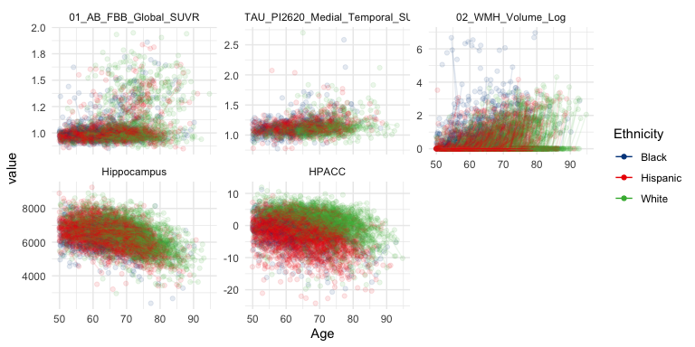

<!-- README.md is generated from README.Rmd. Please edit that file -->

<!-- R package version convention: first two digits are for code; last digit is data release number  -->

# HABS-HD <a href="https://apps.unthsc.edu/itr/research/"></a>

## Overview

`HABSHD` is an R package containing data and code to reproduce results
from the **The Health & Aging Brain Study: Health Disparities
(HABS-HD)** study (O’Bryant et al. 2021). `HABSHD` is a bundle of data,
analysis code examples, and html and pdf documentation. The html
documentation is viewable at <https://github.com/mcdonohue/HABSHD>.

All data, including the `HABSHD` R package, is avalialable from
<https://apps.unthsc.edu/itr/research/> after registering and agreeing
to the [data use
agreement](https://apps.unthsc.edu/itr/assets/documents/HABS_HD%20DUA.final.pdf).

## Installation

To install `HABSHD`:

- Register at <https://apps.unthsc.edu/itr/research>
- Download `HABSHD_0.3.6.1.tar.gz` from
  <https://apps.unthsc.edu/itr/research/>
- In R, run
  `install.packages("path/to/HABSHD_0.3.6.1.tar.gz", repos = NULL, type = "source")`

The script to build this R package can be found in
[tools](https://github.com/mcdonohue/HABSHD/tree/main/tools).

The code below demonstrates how to use data in the `HABSHD` package and
R Core Team (2024) to derive some basic summaries.

# Baseline characteristics tables

``` r
tableby(CDX_Cog ~ . , data = HD_subjinfo %>% 
    select(-Med_ID, -Visit_ID, -APOE4_rs429358, -APOE4_rs7412)) %>%
  summary(labelTranslations = HD_labels, digits = 1)
```

|  | Cognitively Unimpaired (N=2787) | Mild cognitive impairment (N=803) | Dementia (N=236) | Undetermined (N=12) | Total (N=3838) | p value |
|:---|:--:|:--:|:--:|:--:|:--:|---:|
| **Age** |  |  |  |  |  | \< 0.001 |
|    Mean (SD) | 64.4 (8.4) | 65.0 (8.8) | 68.7 (10.1) | 59.8 (8.3) | 64.8 (8.6) |  |
|    Range | 50.0 - 92.0 | 50.0 - 92.0 | 50.0 - 91.0 | 50.0 - 74.0 | 50.0 - 92.0 |  |
| **Ethnicity** |  |  |  |  |  | \< 0.001 |
|    Black | 686 (24.6%) | 306 (38.1%) | 68 (28.8%) | 5 (41.7%) | 1065 (27.7%) |  |
|    Hispanic | 1024 (36.7%) | 306 (38.1%) | 89 (37.7%) | 6 (50.0%) | 1425 (37.1%) |  |
|    White | 1077 (38.6%) | 191 (23.8%) | 79 (33.5%) | 1 (8.3%) | 1348 (35.1%) |  |
| **Hispanic** |  |  |  |  |  | 0.707 |
|    No | 1763 (63.3%) | 497 (61.9%) | 147 (62.3%) | 6 (50.0%) | 2413 (62.9%) |  |
|    Yes | 1024 (36.7%) | 306 (38.1%) | 89 (37.7%) | 6 (50.0%) | 1425 (37.1%) |  |
| **Race White** |  |  |  |  |  | \< 0.001 |
|    No | 694 (24.9%) | 314 (39.1%) | 70 (29.7%) | 5 (41.7%) | 1083 (28.2%) |  |
|    yes | 2093 (75.1%) | 489 (60.9%) | 166 (70.3%) | 7 (58.3%) | 2755 (71.8%) |  |
| **Race Black** |  |  |  |  |  | \< 0.001 |
|    No | 2093 (75.1%) | 492 (61.3%) | 166 (70.3%) | 7 (58.3%) | 2758 (71.9%) |  |
|    yes | 694 (24.9%) | 311 (38.7%) | 70 (29.7%) | 5 (41.7%) | 1080 (28.1%) |  |
| **Race IndianAlaska** |  |  |  |  |  | 0.273 |
|    No | 2770 (99.4%) | 793 (98.8%) | 235 (99.6%) | 12 (100.0%) | 3810 (99.3%) |  |
|    yes | 17 (0.6%) | 10 (1.2%) | 1 (0.4%) | 0 (0.0%) | 28 (0.7%) |  |
| **Race Specify AmerInd Tribe** |  |  |  |  |  |  |
|    N-Miss | 2787 | 803 | 236 | 12 | 3838 |  |
|    No | 0 | 0 | 0 | 0 | 0 |  |
|    yes | 0 | 0 | 0 | 0 | 0 |  |
| **Race Asian** |  |  |  |  |  | 0.899 |
|    No | 2781 (99.8%) | 801 (99.8%) | 236 (100.0%) | 12 (100.0%) | 3830 (99.8%) |  |
|    yes | 6 (0.2%) | 2 (0.2%) | 0 (0.0%) | 0 (0.0%) | 8 (0.2%) |  |
| **Race Specify Asian Race** |  |  |  |  |  |  |
|    N-Miss | 2787 | 803 | 236 | 12 | 3838 |  |
|    No | 0 | 0 | 0 | 0 | 0 |  |
|    yes | 0 | 0 | 0 | 0 | 0 |  |
| **Race Japanese** |  |  |  |  |  | 0.945 |
|    No | 2786 (100.0%) | 803 (100.0%) | 236 (100.0%) | 12 (100.0%) | 3837 (100.0%) |  |
|    yes | 1 (0.0%) | 0 (0.0%) | 0 (0.0%) | 0 (0.0%) | 1 (0.0%) |  |
| **Race Korean** |  |  |  |  |  | 0.945 |
|    No | 2786 (100.0%) | 803 (100.0%) | 236 (100.0%) | 12 (100.0%) | 3837 (100.0%) |  |
|    yes | 1 (0.0%) | 0 (0.0%) | 0 (0.0%) | 0 (0.0%) | 1 (0.0%) |  |
| **Race Vietnamese** |  |  |  |  |  |  |
|    No | 2787 (100.0%) | 803 (100.0%) | 236 (100.0%) | 12 (100.0%) | 3838 (100.0%) |  |
|    yes | 0 (0.0%) | 0 (0.0%) | 0 (0.0%) | 0 (0.0%) | 0 (0.0%) |  |
| **Race NativeHawaiian** |  |  |  |  |  |  |
|    No | 2787 (100.0%) | 803 (100.0%) | 236 (100.0%) | 12 (100.0%) | 3838 (100.0%) |  |
|    yes | 0 (0.0%) | 0 (0.0%) | 0 (0.0%) | 0 (0.0%) | 0 (0.0%) |  |
| **Race GuamChamorro** |  |  |  |  |  |  |
|    No | 2787 (100.0%) | 803 (100.0%) | 236 (100.0%) | 12 (100.0%) | 3838 (100.0%) |  |
|    yes | 0 (0.0%) | 0 (0.0%) | 0 (0.0%) | 0 (0.0%) | 0 (0.0%) |  |
| **Race Samoan** |  |  |  |  |  |  |
|    No | 2787 (100.0%) | 803 (100.0%) | 236 (100.0%) | 12 (100.0%) | 3838 (100.0%) |  |
|    yes | 0 (0.0%) | 0 (0.0%) | 0 (0.0%) | 0 (0.0%) | 0 (0.0%) |  |
| **Race OtherPacific** |  |  |  |  |  | 0.860 |
|    N-Miss | 9 | 0 | 2 | 0 | 11 |  |
|    Mean (SD) | 0.0 (0.0) | 0.0 (0.0) | 0.0 (0.0) | 0.0 (0.0) | 0.0 (0.0) |  |
|    Range | 0.0 - 1.0 | 0.0 - 0.0 | 0.0 - 0.0 | 0.0 - 0.0 | 0.0 - 1.0 |  |
| **Race Specify OtherPacific Race** |  |  |  |  |  |  |
|    N-Miss | 2787 | 803 | 236 | 12 | 3838 |  |
|    FALSE | 0 | 0 | 0 | 0 | 0 |  |
|    TRUE | 0 | 0 | 0 | 0 | 0 |  |
| **Race Other** |  |  |  |  |  | 0.233 |
|    N-Miss | 0 | 0 | 1 | 0 | 1 |  |
|    Mean (SD) | 0.0 (0.0) | 0.0 (0.0) | 0.0 (0.1) | 0.0 (0.0) | 0.0 (0.0) |  |
|    Range | 0.0 - 1.0 | 0.0 - 0.0 | 0.0 - 1.0 | 0.0 - 0.0 | 0.0 - 1.0 |  |
| **Race Specify** |  |  |  |  |  |  |
|    N-Miss | 2784 | 803 | 235 | 12 | 3834 |  |
|    Iranian, Indo-European | 0 (0.0%) | 0 | 1 (100.0%) | 0 | 1 (25.0%) |  |
|    mexicana | 1 (33.3%) | 0 | 0 (0.0%) | 0 | 1 (25.0%) |  |
|    Meztizo | 1 (33.3%) | 0 | 0 (0.0%) | 0 | 1 (25.0%) |  |
|    Native American | 1 (33.3%) | 0 | 0 (0.0%) | 0 | 1 (25.0%) |  |
| **Gender** |  |  |  |  |  | \< 0.001 |
|    Mean (SD) | 0.7 (0.5) | 0.5 (0.5) | 0.5 (0.5) | 0.7 (0.5) | 0.6 (0.5) |  |
|    Range | 0.0 - 1.0 | 0.0 - 1.0 | 0.0 - 1.0 | 0.0 - 1.0 | 0.0 - 1.0 |  |
| **Interview Language** |  |  |  |  |  | 0.204 |
|    English | 2177 (78.1%) | 625 (77.8%) | 175 (74.2%) | 7 (58.3%) | 2984 (77.7%) |  |
|    Spanish | 610 (21.9%) | 178 (22.2%) | 61 (25.8%) | 5 (41.7%) | 854 (22.3%) |  |
| **Language Primary** |  |  |  |  |  | 0.745 |
|    N-Miss | 7 | 2 | 2 | 0 | 11 |  |
|    English | 2119 (76.2%) | 607 (75.8%) | 173 (73.9%) | 7 (58.3%) | 2906 (75.9%) |  |
|    Spanish | 659 (23.7%) | 194 (24.2%) | 61 (26.1%) | 5 (41.7%) | 919 (24.0%) |  |
|    Other | 2 (0.1%) | 0 (0.0%) | 0 (0.0%) | 0 (0.0%) | 2 (0.1%) |  |
| **ADI StateRank** |  |  |  |  |  | \< 0.001 |
|    N-Miss | 461 | 146 | 42 | 11 | 660 |  |
|    Mean (SD) | 4.8 (2.9) | 5.8 (2.8) | 5.8 (2.9) | 3.0 (NA) | 5.1 (2.9) |  |
|    Range | 1.0 - 10.0 | 1.0 - 10.0 | 1.0 - 10.0 | 3.0 - 3.0 | 1.0 - 10.0 |  |
| **MMSE Total** |  |  |  |  |  | \< 0.001 |
|    N-Miss | 13 | 7 | 2 | 0 | 22 |  |
|    Mean (SD) | 28.1 (2.1) | 26.5 (3.0) | 21.2 (6.0) | 23.6 (5.7) | 27.4 (3.2) |  |
|    Range | 15.0 - 30.0 | 12.0 - 30.0 | 2.0 - 30.0 | 9.0 - 30.0 | 2.0 - 30.0 |  |
| **Digit Symbol Substitution** |  |  |  |  |  | \< 0.001 |
|    N-Miss | 4 | 7 | 24 | 0 | 35 |  |
|    Mean (SD) | 44.4 (11.8) | 35.5 (12.0) | 22.6 (12.1) | 27.8 (13.7) | 41.3 (13.2) |  |
|    Range | 5.0 - 88.0 | 2.0 - 69.0 | 0.0 - 62.0 | 4.0 - 58.0 | 0.0 - 88.0 |  |
| **SEVLT DR Total** |  |  |  |  |  | \< 0.001 |
|    N-Miss | 9 | 5 | 11 | 0 | 25 |  |
|    Mean (SD) | 8.5 (2.8) | 4.8 (3.2) | 1.7 (2.4) | 4.5 (2.7) | 7.3 (3.5) |  |
|    Range | 0.0 - 15.0 | 0.0 - 14.0 | 0.0 - 10.0 | 0.0 - 8.0 | 0.0 - 15.0 |  |
| **LM2 AB Total** |  |  |  |  |  | \< 0.001 |
|    N-Miss | 3 | 1 | 1 | 0 | 5 |  |
|    Mean (SD) | 23.4 (7.4) | 15.0 (7.5) | 6.2 (6.4) | 9.8 (4.4) | 20.5 (8.9) |  |
|    Range | 1.0 - 44.0 | 0.0 - 38.0 | 0.0 - 40.0 | 2.0 - 18.0 | 0.0 - 44.0 |  |
| **Animal Total** |  |  |  |  |  | \< 0.001 |
|    N-Miss | 1 | 0 | 1 | 0 | 2 |  |
|    Mean (SD) | 18.9 (4.7) | 15.5 (4.8) | 9.9 (5.2) | 13.2 (5.8) | 17.6 (5.3) |  |
|    Range | 2.0 - 46.0 | 0.0 - 37.0 | 0.0 - 24.0 | 5.0 - 23.0 | 0.0 - 46.0 |  |
| **APOE4 Genotype** |  |  |  |  |  | \< 0.001 |
|    N-Miss | 351 | 111 | 26 | 7 | 495 |  |
|    E2E2 | 9 (0.4%) | 6 (0.9%) | 0 (0.0%) | 0 (0.0%) | 15 (0.4%) |  |
|    E2E3 | 249 (10.2%) | 64 (9.2%) | 18 (8.6%) | 0 (0.0%) | 331 (9.9%) |  |
|    E2E4 | 59 (2.4%) | 13 (1.9%) | 4 (1.9%) | 0 (0.0%) | 76 (2.3%) |  |
|    E3E3 | 1512 (62.1%) | 418 (60.4%) | 100 (47.6%) | 4 (80.0%) | 2034 (60.8%) |  |
|    E3E4 | 553 (22.7%) | 172 (24.9%) | 66 (31.4%) | 1 (20.0%) | 792 (23.7%) |  |
|    E4E4 | 54 (2.2%) | 19 (2.7%) | 22 (10.5%) | 0 (0.0%) | 95 (2.8%) |  |
| **APOE4 Positivity** |  |  |  |  |  | \< 0.001 |
|    N-Miss | 351 | 111 | 26 | 7 | 495 |  |
|    Mean (SD) | 0.3 (0.4) | 0.3 (0.5) | 0.4 (0.5) | 0.2 (0.4) | 0.3 (0.5) |  |
|    Range | 0.0 - 1.0 | 0.0 - 1.0 | 0.0 - 1.0 | 0.0 - 1.0 | 0.0 - 1.0 |  |
| **AB FBB AB pos** |  |  |  |  |  | \< 0.001 |
|    N-Miss | 945 | 263 | 94 | 6 | 1308 |  |
|    Mean (SD) | 0.2 (0.4) | 0.2 (0.4) | 0.5 (0.5) | 0.2 (0.4) | 0.2 (0.4) |  |
|    Range | 0.0 - 1.0 | 0.0 - 1.0 | 0.0 - 1.0 | 0.0 - 1.0 | 0.0 - 1.0 |  |
| **TAU PI2620 Medial Temporal SUVR** |  |  |  |  |  | \< 0.001 |
|    N-Miss | 1669 | 460 | 160 | 8 | 2297 |  |
|    Mean (SD) | 1.1 (0.1) | 1.2 (0.2) | 1.2 (0.3) | 1.1 (0.2) | 1.1 (0.2) |  |
|    Range | 0.8 - 1.8 | 0.8 - 2.7 | 0.9 - 2.6 | 0.9 - 1.4 | 0.8 - 2.7 |  |
| **L hippocampus** |  |  |  |  |  | \< 0.001 |
|    N-Miss | 280 | 92 | 26 | 6 | 404 |  |
|    Mean (SD) | 3169.4 (376.5) | 3062.3 (426.4) | 2716.9 (564.3) | 3005.8 (331.9) | 3119.2 (416.0) |  |
|    Range | 1534.0 - 4555.0 | 1555.1 - 4338.2 | 1135.0 - 4132.7 | 2610.0 - 3478.0 | 1135.0 - 4555.0 |  |
| **R hippocampus** |  |  |  |  |  | \< 0.001 |
|    N-Miss | 260 | 94 | 27 | 5 | 386 |  |
|    Mean (SD) | 3305.5 (389.6) | 3207.8 (411.9) | 2813.8 (605.6) | 3176.0 (415.1) | 3255.4 (427.1) |  |
|    Range | 1800.7 - 4701.0 | 1910.0 - 4425.0 | 1237.0 - 4164.7 | 2577.0 - 3562.0 | 1237.0 - 4701.0 |  |
| **ICV HD** |  |  |  |  |  | 0.539 |
|    N-Miss | 194 | 68 | 9 | 4 | 275 |  |
|    Mean (SD) | 1417218.0 (138002.6) | 1424440.3 (149946.3) | 1426724.6 (151697.7) | 1416410.6 (61563.6) | 1419311.7 (141319.7) |  |
|    Range | 1029783.2 - 1979485.0 | 1040497.2 - 1885733.6 | 1042479.9 - 1964078.0 | 1351896.0 - 1531047.0 | 1029783.2 - 1979485.0 |  |
| **WMH Volume Raw** |  |  |  |  |  | \< 0.001 |
|    N-Miss | 155 | 70 | 18 | 0 | 243 |  |
|    Mean (SD) | 4.6 (31.6) | 8.3 (50.5) | 17.8 (94.8) | 4.5 (7.1) | 6.1 (42.5) |  |
|    Range | 0.0 - 785.8 | 0.0 - 832.4 | 0.0 - 1056.5 | 0.1 - 24.8 | 0.0 - 1056.5 |  |
| **WMH Volume Log** |  |  |  |  |  | \< 0.001 |
|    N-Miss | 156 | 70 | 19 | 0 | 245 |  |
|    Mean (SD) | 0.3 (0.7) | 0.4 (0.9) | 0.6 (1.1) | 1.2 (0.9) | 0.3 (0.7) |  |
|    Range | 0.0 - 6.7 | 0.0 - 5.9 | 0.0 - 7.0 | 0.1 - 3.3 | 0.0 - 7.0 |  |
| **Animal Total Z** |  |  |  |  |  | \< 0.001 |
|    N-Miss | 1 | 0 | 1 | 0 | 2 |  |
|    Mean (SD) | 0.0 (1.0) | -0.7 (1.0) | -1.9 (1.1) | -1.2 (1.2) | -0.3 (1.1) |  |
|    Range | -3.6 - 5.7 | -4.0 - 3.8 | -4.0 - 1.1 | -2.9 - 0.9 | -4.0 - 5.7 |  |
| **Digit Symbol Substitution Z** |  |  |  |  |  | \< 0.001 |
|    N-Miss | 4 | 7 | 24 | 0 | 35 |  |
|    Mean (SD) | -0.0 (1.0) | -0.7 (1.0) | -1.8 (1.0) | -1.4 (1.2) | -0.3 (1.1) |  |
|    Range | -3.3 - 3.7 | -3.6 - 2.1 | -3.7 - 1.5 | -3.4 - 1.2 | -3.7 - 3.7 |  |
| **LM2 AB Total Z** |  |  |  |  |  | \< 0.001 |
|    N-Miss | 3 | 1 | 1 | 0 | 5 |  |
|    Mean (SD) | 0.0 (1.0) | -1.1 (1.0) | -2.3 (0.9) | -1.9 (0.6) | -0.4 (1.2) |  |
|    Range | -3.0 - 2.8 | -3.2 - 2.0 | -3.2 - 2.3 | -2.9 - -0.7 | -3.2 - 2.8 |  |
| **MMSE Total Z** |  |  |  |  |  | \< 0.001 |
|    N-Miss | 13 | 7 | 2 | 0 | 22 |  |
|    Mean (SD) | -0.0 (1.0) | -0.7 (1.4) | -3.2 (2.8) | -2.1 (2.7) | -0.4 (1.5) |  |
|    Range | -6.2 - 0.9 | -7.6 - 0.9 | -12.3 - 0.9 | -9.0 - 0.9 | -12.3 - 0.9 |  |
| **SEVLT DR Total Z** |  |  |  |  |  | \< 0.001 |
|    N-Miss | 9 | 5 | 11 | 0 | 25 |  |
|    Mean (SD) | -0.0 (1.0) | -1.3 (1.1) | -2.4 (0.8) | -1.4 (1.0) | -0.4 (1.3) |  |
|    Range | -3.0 - 2.3 | -3.0 - 1.9 | -3.0 - 0.5 | -3.0 - -0.2 | -3.0 - 2.3 |  |
| **HPACC** |  |  |  |  |  | \< 0.001 |
|    N-Miss | 29 | 19 | 33 | 0 | 81 |  |
|    Mean (SD) | 0.0 (3.6) | -4.6 (3.7) | -11.0 (4.8) | -8.0 (5.2) | -1.6 (4.7) |  |
|    Range | -13.5 - 11.9 | -17.6 - 6.0 | -24.2 - 0.6 | -21.1 - -1.8 | -24.2 - 11.9 |  |
| **HPACC NA** |  |  |  |  |  | \< 0.001 |
|    Mean (SD) | 0.0 (0.1) | 0.0 (0.2) | 0.2 (0.5) | 0.0 (0.0) | 0.0 (0.2) |  |
|    Range | 0.0 - 2.0 | 0.0 - 2.0 | 0.0 - 4.0 | 0.0 - 0.0 | 0.0 - 4.0 |  |
| **HPACC NAsum** |  |  |  |  |  | \< 0.001 |
|    Mean (SD) | -0.0 (3.6) | -4.6 (3.7) | -11.4 (5.0) | -8.0 (5.2) | -1.7 (4.9) |  |
|    Range | -13.5 - 11.9 | -17.6 - 6.0 | -24.2 - 0.6 | -21.1 - -1.8 | -24.2 - 11.9 |  |
| **HPACC Prorated** |  |  |  |  |  | \< 0.001 |
|    N-Miss | 0 | 0 | 1 | 0 | 1 |  |
|    Mean (SD) | -0.0 (3.6) | -4.7 (3.7) | -12.0 (5.6) | -8.0 (5.2) | -1.7 (5.0) |  |
|    Range | -14.2 - 11.9 | -17.6 - 6.0 | -28.1 - 0.6 | -21.1 - -1.8 | -28.1 - 11.9 |  |
| **-HPACC NAsum** |  |  |  |  |  | \< 0.001 |
|    Mean (SD) | 0.0 (3.6) | 4.6 (3.7) | 11.4 (5.0) | 8.0 (5.2) | 1.7 (4.9) |  |
|    Range | -11.9 - 13.5 | -6.0 - 17.6 | -0.6 - 24.2 | 1.8 - 21.1 | -11.9 - 24.2 |  |

``` r

tableby(Ethnicity ~ . , data = HD_subjinfo %>% 
    select(-Med_ID, -Visit_ID, -APOE4_rs429358, -APOE4_rs7412)) %>%
  summary(labelTranslations = HD_labels, digits = 1)
```

|  | Black (N=1065) | Hispanic (N=1425) | White (N=1348) | Total (N=3838) | p value |
|:---|:--:|:--:|:--:|:--:|---:|
| **CDX Cog** |  |  |  |  | \< 0.001 |
|    Cognitively Unimpaired | 686 (64.4%) | 1024 (71.9%) | 1077 (79.9%) | 2787 (72.6%) |  |
|    Mild cognitive impairment | 306 (28.7%) | 306 (21.5%) | 191 (14.2%) | 803 (20.9%) |  |
|    Dementia | 68 (6.4%) | 89 (6.2%) | 79 (5.9%) | 236 (6.1%) |  |
|    Undetermined | 5 (0.5%) | 6 (0.4%) | 1 (0.1%) | 12 (0.3%) |  |
| **Age** |  |  |  |  | \< 0.001 |
|    Mean (SD) | 63.0 (7.8) | 62.8 (8.1) | 68.4 (8.7) | 64.8 (8.6) |  |
|    Range | 50.0 - 92.0 | 50.0 - 91.0 | 50.0 - 92.0 | 50.0 - 92.0 |  |
| **Hispanic** |  |  |  |  | \< 0.001 |
|    No | 1065 (100.0%) | 0 (0.0%) | 1348 (100.0%) | 2413 (62.9%) |  |
|    Yes | 0 (0.0%) | 1425 (100.0%) | 0 (0.0%) | 1425 (37.1%) |  |
| **Race White** |  |  |  |  | \< 0.001 |
|    No | 1060 (99.5%) | 23 (1.6%) | 0 (0.0%) | 1083 (28.2%) |  |
|    yes | 5 (0.5%) | 1402 (98.4%) | 1348 (100.0%) | 2755 (71.8%) |  |
| **Race Black** |  |  |  |  | \< 0.001 |
|    No | 0 (0.0%) | 1410 (98.9%) | 1348 (100.0%) | 2758 (71.9%) |  |
|    yes | 1065 (100.0%) | 15 (1.1%) | 0 (0.0%) | 1080 (28.1%) |  |
| **Race IndianAlaska** |  |  |  |  | 0.073 |
|    No | 1061 (99.6%) | 1409 (98.9%) | 1340 (99.4%) | 3810 (99.3%) |  |
|    yes | 4 (0.4%) | 16 (1.1%) | 8 (0.6%) | 28 (0.7%) |  |
| **Race Specify AmerInd Tribe** |  |  |  |  |  |
|    N-Miss | 1065 | 1425 | 1348 | 3838 |  |
|    No | 0 | 0 | 0 | 0 |  |
|    yes | 0 | 0 | 0 | 0 |  |
| **Race Asian** |  |  |  |  | 0.983 |
|    No | 1063 (99.8%) | 1422 (99.8%) | 1345 (99.8%) | 3830 (99.8%) |  |
|    yes | 2 (0.2%) | 3 (0.2%) | 3 (0.2%) | 8 (0.2%) |  |
| **Race Specify Asian Race** |  |  |  |  |  |
|    N-Miss | 1065 | 1425 | 1348 | 3838 |  |
|    No | 0 | 0 | 0 | 0 |  |
|    yes | 0 | 0 | 0 | 0 |  |
| **Race Japanese** |  |  |  |  | 0.397 |
|    No | 1065 (100.0%) | 1425 (100.0%) | 1347 (99.9%) | 3837 (100.0%) |  |
|    yes | 0 (0.0%) | 0 (0.0%) | 1 (0.1%) | 1 (0.0%) |  |
| **Race Korean** |  |  |  |  | 0.397 |
|    No | 1065 (100.0%) | 1425 (100.0%) | 1347 (99.9%) | 3837 (100.0%) |  |
|    yes | 0 (0.0%) | 0 (0.0%) | 1 (0.1%) | 1 (0.0%) |  |
| **Race Vietnamese** |  |  |  |  |  |
|    No | 1065 (100.0%) | 1425 (100.0%) | 1348 (100.0%) | 3838 (100.0%) |  |
|    yes | 0 (0.0%) | 0 (0.0%) | 0 (0.0%) | 0 (0.0%) |  |
| **Race NativeHawaiian** |  |  |  |  |  |
|    No | 1065 (100.0%) | 1425 (100.0%) | 1348 (100.0%) | 3838 (100.0%) |  |
|    yes | 0 (0.0%) | 0 (0.0%) | 0 (0.0%) | 0 (0.0%) |  |
| **Race GuamChamorro** |  |  |  |  |  |
|    No | 1065 (100.0%) | 1425 (100.0%) | 1348 (100.0%) | 3838 (100.0%) |  |
|    yes | 0 (0.0%) | 0 (0.0%) | 0 (0.0%) | 0 (0.0%) |  |
| **Race Samoan** |  |  |  |  |  |
|    No | 1065 (100.0%) | 1425 (100.0%) | 1348 (100.0%) | 3838 (100.0%) |  |
|    yes | 0 (0.0%) | 0 (0.0%) | 0 (0.0%) | 0 (0.0%) |  |
| **Race OtherPacific** |  |  |  |  | 0.158 |
|    N-Miss | 0 | 7 | 4 | 11 |  |
|    Mean (SD) | 0.0 (0.0) | 0.0 (0.0) | 0.0 (0.0) | 0.0 (0.0) |  |
|    Range | 0.0 - 0.0 | 0.0 - 0.0 | 0.0 - 1.0 | 0.0 - 1.0 |  |
| **Race Specify OtherPacific Race** |  |  |  |  |  |
|    N-Miss | 1065 | 1425 | 1348 | 3838 |  |
|    FALSE | 0 | 0 | 0 | 0 |  |
|    TRUE | 0 | 0 | 0 | 0 |  |
| **Race Other** |  |  |  |  | 0.463 |
|    N-Miss | 0 | 0 | 1 | 1 |  |
|    Mean (SD) | 0.0 (0.0) | 0.0 (0.0) | 0.0 (0.0) | 0.0 (0.0) |  |
|    Range | 0.0 - 0.0 | 0.0 - 1.0 | 0.0 - 1.0 | 0.0 - 1.0 |  |
| **Race Specify** |  |  |  |  |  |
|    N-Miss | 1065 | 1422 | 1347 | 3834 |  |
|    Iranian, Indo-European | 0 | 0 (0.0%) | 1 (100.0%) | 1 (25.0%) |  |
|    mexicana | 0 | 1 (33.3%) | 0 (0.0%) | 1 (25.0%) |  |
|    Meztizo | 0 | 1 (33.3%) | 0 (0.0%) | 1 (25.0%) |  |
|    Native American | 0 | 1 (33.3%) | 0 (0.0%) | 1 (25.0%) |  |
| **Gender** |  |  |  |  | \< 0.001 |
|    Mean (SD) | 0.6 (0.5) | 0.7 (0.5) | 0.6 (0.5) | 0.6 (0.5) |  |
|    Range | 0.0 - 1.0 | 0.0 - 1.0 | 0.0 - 1.0 | 0.0 - 1.0 |  |
| **Interview Language** |  |  |  |  | \< 0.001 |
|    English | 1065 (100.0%) | 571 (40.1%) | 1348 (100.0%) | 2984 (77.7%) |  |
|    Spanish | 0 (0.0%) | 854 (59.9%) | 0 (0.0%) | 854 (22.3%) |  |
| **Language Primary** |  |  |  |  | \< 0.001 |
|    N-Miss | 1 | 2 | 8 | 11 |  |
|    English | 1064 (100.0%) | 503 (35.3%) | 1339 (99.9%) | 2906 (75.9%) |  |
|    Spanish | 0 (0.0%) | 919 (64.6%) | 0 (0.0%) | 919 (24.0%) |  |
|    Other | 0 (0.0%) | 1 (0.1%) | 1 (0.1%) | 2 (0.1%) |  |
| **ADI StateRank** |  |  |  |  | \< 0.001 |
|    N-Miss | 227 | 246 | 187 | 660 |  |
|    Mean (SD) | 5.4 (3.0) | 6.4 (2.6) | 3.5 (2.2) | 5.1 (2.9) |  |
|    Range | 1.0 - 10.0 | 1.0 - 10.0 | 1.0 - 10.0 | 1.0 - 10.0 |  |
| **MMSE Total** |  |  |  |  | \< 0.001 |
|    N-Miss | 7 | 8 | 7 | 22 |  |
|    Mean (SD) | 27.5 (2.7) | 26.0 (3.8) | 28.6 (2.2) | 27.4 (3.2) |  |
|    Range | 2.0 - 30.0 | 3.0 - 30.0 | 4.0 - 30.0 | 2.0 - 30.0 |  |
| **Digit Symbol Substitution** |  |  |  |  | \< 0.001 |
|    N-Miss | 11 | 15 | 9 | 35 |  |
|    Mean (SD) | 42.2 (12.7) | 36.4 (13.3) | 45.6 (11.9) | 41.3 (13.2) |  |
|    Range | 3.0 - 87.0 | 0.0 - 73.0 | 3.0 - 88.0 | 0.0 - 88.0 |  |
| **SEVLT DR Total** |  |  |  |  | \< 0.001 |
|    N-Miss | 2 | 14 | 9 | 25 |  |
|    Mean (SD) | 7.0 (3.5) | 6.9 (3.4) | 8.1 (3.6) | 7.3 (3.5) |  |
|    Range | 0.0 - 15.0 | 0.0 - 15.0 | 0.0 - 15.0 | 0.0 - 15.0 |  |
| **LM2 AB Total** |  |  |  |  | \< 0.001 |
|    N-Miss | 0 | 3 | 2 | 5 |  |
|    Mean (SD) | 18.9 (8.3) | 18.5 (8.2) | 23.9 (9.0) | 20.5 (8.9) |  |
|    Range | 0.0 - 40.0 | 0.0 - 41.0 | 0.0 - 44.0 | 0.0 - 44.0 |  |
| **Animal Total** |  |  |  |  | \< 0.001 |
|    N-Miss | 0 | 0 | 2 | 2 |  |
|    Mean (SD) | 17.3 (5.2) | 16.6 (5.0) | 18.9 (5.5) | 17.6 (5.3) |  |
|    Range | 0.0 - 35.0 | 0.0 - 33.0 | 0.0 - 46.0 | 0.0 - 46.0 |  |
| **APOE4 Genotype** |  |  |  |  | \< 0.001 |
|    N-Miss | 235 | 146 | 114 | 495 |  |
|    E2E2 | 9 (1.1%) | 1 (0.1%) | 5 (0.4%) | 15 (0.4%) |  |
|    E2E3 | 101 (12.2%) | 80 (6.3%) | 150 (12.2%) | 331 (9.9%) |  |
|    E2E4 | 41 (4.9%) | 10 (0.8%) | 25 (2.0%) | 76 (2.3%) |  |
|    E3E3 | 377 (45.4%) | 947 (74.0%) | 710 (57.5%) | 2034 (60.8%) |  |
|    E3E4 | 253 (30.5%) | 225 (17.6%) | 314 (25.4%) | 792 (23.7%) |  |
|    E4E4 | 49 (5.9%) | 16 (1.3%) | 30 (2.4%) | 95 (2.8%) |  |
| **APOE4 Positivity** |  |  |  |  | \< 0.001 |
|    N-Miss | 235 | 146 | 114 | 495 |  |
|    Mean (SD) | 0.4 (0.5) | 0.2 (0.4) | 0.3 (0.5) | 0.3 (0.5) |  |
|    Range | 0.0 - 1.0 | 0.0 - 1.0 | 0.0 - 1.0 | 0.0 - 1.0 |  |
| **AB FBB AB pos** |  |  |  |  | \< 0.001 |
|    N-Miss | 189 | 627 | 492 | 1308 |  |
|    Mean (SD) | 0.2 (0.4) | 0.1 (0.4) | 0.3 (0.5) | 0.2 (0.4) |  |
|    Range | 0.0 - 1.0 | 0.0 - 1.0 | 0.0 - 1.0 | 0.0 - 1.0 |  |
| **TAU PI2620 Medial Temporal SUVR** |  |  |  |  | 0.536 |
|    N-Miss | 539 | 977 | 781 | 2297 |  |
|    Mean (SD) | 1.1 (0.2) | 1.1 (0.1) | 1.1 (0.2) | 1.1 (0.2) |  |
|    Range | 0.8 - 2.6 | 0.8 - 2.1 | 0.9 - 2.7 | 0.8 - 2.7 |  |
| **L hippocampus** |  |  |  |  | 0.002 |
|    N-Miss | 165 | 132 | 107 | 404 |  |
|    Mean (SD) | 3080.2 (395.2) | 3145.0 (406.3) | 3120.8 (438.4) | 3119.2 (416.0) |  |
|    Range | 1135.0 - 4074.0 | 1406.9 - 4555.0 | 1545.0 - 4530.0 | 1135.0 - 4555.0 |  |
| **R hippocampus** |  |  |  |  | \< 0.001 |
|    N-Miss | 160 | 126 | 100 | 386 |  |
|    Mean (SD) | 3199.0 (405.2) | 3290.1 (411.7) | 3260.2 (453.7) | 3255.4 (427.1) |  |
|    Range | 1237.0 - 4219.0 | 1558.0 - 4701.0 | 1364.2 - 4513.1 | 1237.0 - 4701.0 |  |
| **ICV HD** |  |  |  |  | \< 0.001 |
|    N-Miss | 114 | 96 | 65 | 275 |  |
|    Mean (SD) | 1418430.9 (131274.9) | 1380710.8 (131924.8) | 1459949.5 (146603.9) | 1419311.7 (141319.7) |  |
|    Range | 1040497.2 - 1964078.0 | 1029783.2 - 1794228.8 | 1064797.6 - 1979485.0 | 1029783.2 - 1979485.0 |  |
| **WMH Volume Raw** |  |  |  |  | \< 0.001 |
|    N-Miss | 119 | 78 | 46 | 243 |  |
|    Mean (SD) | 14.1 (78.7) | 2.8 (19.2) | 3.8 (6.8) | 6.1 (42.5) |  |
|    Range | 0.0 - 1056.5 | 0.0 - 683.2 | 0.0 - 74.4 | 0.0 - 1056.5 |  |
| **WMH Volume Log** |  |  |  |  | \< 0.001 |
|    N-Miss | 121 | 78 | 46 | 245 |  |
|    Mean (SD) | 0.8 (1.1) | 0.2 (0.4) | 0.2 (0.6) | 0.3 (0.7) |  |
|    Range | 0.0 - 7.0 | 0.0 - 3.5 | 0.0 - 3.8 | 0.0 - 7.0 |  |
| **Animal Total Z** |  |  |  |  | \< 0.001 |
|    N-Miss | 0 | 0 | 2 | 2 |  |
|    Mean (SD) | -0.3 (1.1) | -0.5 (1.1) | 0.0 (1.2) | -0.3 (1.1) |  |
|    Range | -4.0 - 3.4 | -4.0 - 3.0 | -4.0 - 5.7 | -4.0 - 5.7 |  |
| **Digit Symbol Substitution Z** |  |  |  |  | \< 0.001 |
|    N-Miss | 11 | 15 | 9 | 35 |  |
|    Mean (SD) | -0.2 (1.1) | -0.7 (1.1) | 0.1 (1.0) | -0.3 (1.1) |  |
|    Range | -3.5 - 3.6 | -3.7 - 2.4 | -3.5 - 3.7 | -3.7 - 3.7 |  |
| **LM2 AB Total Z** |  |  |  |  | \< 0.001 |
|    N-Miss | 0 | 3 | 2 | 5 |  |
|    Mean (SD) | -0.6 (1.1) | -0.7 (1.1) | 0.1 (1.2) | -0.4 (1.2) |  |
|    Range | -3.2 - 2.3 | -3.2 - 2.4 | -3.2 - 2.8 | -3.2 - 2.8 |  |
| **MMSE Total Z** |  |  |  |  | \< 0.001 |
|    N-Miss | 7 | 8 | 7 | 22 |  |
|    Mean (SD) | -0.3 (1.3) | -1.0 (1.8) | 0.2 (1.0) | -0.4 (1.5) |  |
|    Range | -12.3 - 0.9 | -11.8 - 0.9 | -11.4 - 0.9 | -12.3 - 0.9 |  |
| **SEVLT DR Total Z** |  |  |  |  | \< 0.001 |
|    N-Miss | 2 | 14 | 9 | 25 |  |
|    Mean (SD) | -0.6 (1.2) | -0.6 (1.2) | -0.2 (1.3) | -0.4 (1.3) |  |
|    Range | -3.0 - 2.3 | -3.0 - 2.3 | -3.0 - 2.3 | -3.0 - 2.3 |  |
| **HPACC** |  |  |  |  | \< 0.001 |
|    N-Miss | 19 | 35 | 27 | 81 |  |
|    Mean (SD) | -1.9 (4.3) | -3.2 (4.7) | 0.4 (4.3) | -1.6 (4.7) |  |
|    Range | -20.7 - 11.2 | -24.2 - 7.8 | -19.8 - 11.9 | -24.2 - 11.9 |  |
| **HPACC NA** |  |  |  |  | 0.357 |
|    Mean (SD) | 0.0 (0.1) | 0.0 (0.2) | 0.0 (0.2) | 0.0 (0.2) |  |
|    Range | 0.0 - 2.0 | 0.0 - 4.0 | 0.0 - 2.0 | 0.0 - 4.0 |  |
| **HPACC NAsum** |  |  |  |  | \< 0.001 |
|    Mean (SD) | -2.0 (4.4) | -3.3 (4.9) | 0.3 (4.5) | -1.7 (4.9) |  |
|    Range | -22.5 - 11.2 | -24.2 - 7.8 | -21.4 - 11.9 | -24.2 - 11.9 |  |
| **HPACC Prorated** |  |  |  |  | \< 0.001 |
|    N-Miss | 0 | 1 | 0 | 1 |  |
|    Mean (SD) | -2.0 (4.5) | -3.4 (5.0) | 0.2 (4.6) | -1.7 (5.0) |  |
|    Range | -28.1 - 11.2 | -27.5 - 7.8 | -26.8 - 11.9 | -28.1 - 11.9 |  |
| **-HPACC NAsum** |  |  |  |  | \< 0.001 |
|    Mean (SD) | 2.0 (4.4) | 3.3 (4.9) | -0.3 (4.5) | 1.7 (4.9) |  |
|    Range | -11.2 - 22.5 | -7.8 - 24.2 | -11.9 - 21.4 | -11.9 - 24.2 |  |

# Summary plots

``` r
HD_Imaging %>% 
  select(-Ethnicity) %>%
  left_join(HD_Clinical, by = c('Med_ID', 'Visit_ID', 'Age')) %>%
  mutate(Hippocampus = `01_L_hippocampus` + `01_R_hippocampus`) %>%
  select(Med_ID, Age, Ethnicity, `01_AB_FBB_Global_SUVR`, 
    `01_TAU_PI2620_Medial_Temporal_SUVR`, Hippocampus, 
    `02_WMH_Volume_Log`, HPACC) %>%
  pivot_longer(`01_AB_FBB_Global_SUVR`:HPACC) %>%
ggplot(aes(x=Age, y=value, color=Ethnicity)) +
  geom_point(alpha=0.1) +
  geom_line(aes(group = Med_ID), alpha=0.1) +
  facet_wrap(vars(name), scales = 'free_y') +
  guides(colour = guide_legend(override.aes = list(alpha=1)))
#> Warning: Removed 8549 rows containing missing values or values outside the scale range (`geom_point()`).
#> Warning: Removed 4830 rows containing missing values or values outside the scale range (`geom_line()`).
```

<div class="figure">


<p class="caption">

Spaghetti of selected outcomes by age and ethnicity.
</p>

</div>

``` r
HD_Imaging %>% 
  select(-Ethnicity) %>%
  left_join(HD_Clinical, by = c('Med_ID', 'Visit_ID', 'Age')) %>%
  mutate(Hippocampus = `01_L_hippocampus` + `01_R_hippocampus`) %>%
  select(Med_ID, Age, Ethnicity, `01_AB_FBB_Global_SUVR`, 
    `01_TAU_PI2620_Medial_Temporal_SUVR`, Hippocampus, 
    `02_WMH_Volume_Log`, HPACC) %>%
  pivot_longer(`01_AB_FBB_Global_SUVR`:HPACC) %>%
ggplot(aes(x=Age, y=value, color=Ethnicity)) +
  geom_smooth(method = 'loess') +
  geom_rug(alpha = 0.1) +
  facet_wrap(vars(name), scales = 'free_y') +
  guides(colour = guide_legend(override.aes = list(alpha=1)))
#> `geom_smooth()` using formula = 'y ~ x'
#> Warning: Removed 8549 rows containing non-finite outside the scale range (`stat_smooth()`).
```

<div class="figure">


<p class="caption">

Locally weighted scatterplot smooths (LOWESS) of selected outcomes by
age and ethnicity.
</p>

</div>

## References

<div id="refs" class="references csl-bib-body hanging-indent"
entry-spacing="0">

<div id="ref-OBryant2021health" class="csl-entry">

O’Bryant, Sid E, Leigh A Johnson, Robert C Barber, Meredith N Braskie,
Bradley Christian, James R Hall, Nalini Hazra, et al. 2021. “The Health
& Aging Brain Among Latino Elders (HABLE) Study Methods and Participant
Characteristics.” *Alzheimer’s & Dementia: Diagnosis, Assessment &
Disease Monitoring* 13 (1): e12202.

</div>

<div id="ref-R" class="csl-entry">

R Core Team. 2024. *R: A Language and Environment for Statistical
Computing*. Vienna, Austria: R Foundation for Statistical Computing.
<https://www.R-project.org/>.

</div>

</div>
